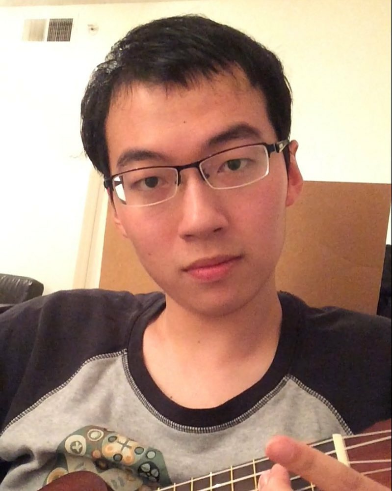

# Summary

I'm a second year Master's student in the _Department of Computer Science in the University of Texas at Austin_

I did my research intern for _computer vision_ in _Microsoft Research_ 

I will be a software engineer at _Google Inc_. in July, 2017.

# Activities in Graduate School

Doing research in Lili Qiu's Wireless Network Lab in CS@UT-Austin

Teaching Assistant:

  -Deep Learning
  
  -Object Oriented Programming

# Publications

[High-precision acoustic motion tracking: demo, MobiCom 2016](http://dl.acm.org/citation.cfm?id=2985617)

[A New Method for Searching Impossible Differentials of Block Cipher, CSSE 2014](https://books.google.com.hk/books?id=bJbqBQAAQBAJ&pg=PA284&dq=isbn+978-1-60595-199-7+huihuang&hl=zh-CN&sa=X&ei=sMH9VIT_PIG5ogTs4IHgBw&ved=0CCYQ6AEwAA#v=onepage&q=isbn%20978-1-60595-199-7%20huihuang&f=false)

[改进 UID 算法分析 LBlock 密码算法, OAPS 2014](http://union.lib.tsinghua.edu.cn/handle/123456789/4705)

# Selected Honors and Awards

Fellowship of University of Texas at Ausint, 2016

Outstanding Graduated Student of Shanghai Jiao Tong University, 2015

Class A Award in Shanghai Jiao Tong University, 2014

# Interests

Network and Security, Wireless Network, Artificial Intelligence

## Other Links:

[Personal Homepage @cs.utexas](http://www.cs.utexas.edu/~huihuang/)

[Linkedin Profile](https://cn.linkedin.com/in/huihuang-zheng-90b25a77)

## Last Updated

January 22nd, 2017
